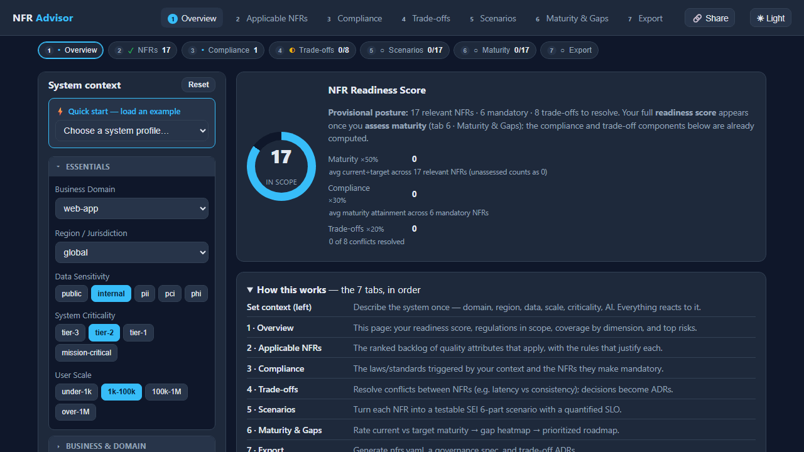

# NFR Advisor

An interactive, structured advisor for **non-functional requirements (NFRs)**. It takes a system's **context** → ranks the **applicable quality attributes** → surfaces **trade-offs** → turns them into **measurable scenarios** → and exports an **as-code NFR spec + ADRs**.

<!-- walkthrough GIF hidden for now (asset kept at docs/journey.gif)


*The full journey: set context once → ranked NFRs (with the signals & alerts that verify them) → compliance → trade-off decisions → scenarios → maturity → readiness score & as-code export.*
-->

*The full journey: set context once → ranked NFRs (with the signals & alerts that verify them) → compliance → trade-off decisions → scenarios → maturity → readiness score & as-code export.*

Grounded in **ISO/IEC 25010**, the **arc42 Quality Model (Q42)**, and **ATAM**. A single-page, data-driven app — static, no backend, no build step, deployable to GitHub Pages.

> Most open resources are *catalogs* (arc42 Q42), *standards* (ISO 25010), or *manual methods* (ATAM). None walk an architect from **context → selection → trade-off → measurable criteria → as-code**. That intersection is what this tool fills.

## How to use it

One page, one persistent **System context** rail on the left (15 dimensions — domain, region/jurisdiction, scale, data sensitivity, availability target, criticality, architecture style, users, residency, lifecycle, AI usage…), and seven views as tabs. Set the context once — every tab reacts live. A **Share** button (top right) copies a permalink that encodes your whole assessment into the URL; a **dark / light theme toggle** is remembered across sessions.

The catalog covers **45 NFRs** across **9 quality categories**, and reacts to **16 context dimensions** (incl. privacy, sustainability/green IT, supply-chain security, safety, data quality, and **AI/ML quality** — explainability, robustness/drift).

| Tab | What it does |
|-----|--------------|
| **Overview** | Cross-dimension dashboard: headline stats (relevant / mandatory / regulations / unresolved trade-offs / avg maturity gap), compliance regimes in scope, coverage-by-dimension chart, top priorities, open risks. |
| **Applicable NFRs** | NFRs grouped into collapsible **ISO/IEC 25010 dimension sections**, ranked within each, with **severity** chips and **MANDATORY** flags. Expand for business impact, compliance drivers, the full **SEI 6-part quality attribute scenario**, the **Why** (exact rules fired), metrics, tactics/patterns, fitness function, conflicts/reinforces. |
| **Compliance** | Regulations triggered by the context — **25 standards across 8 regulatory areas** (GDPR, HIPAA, PCI-DSS, SOC 2, ISO 27001, DORA, EU AI Act, FedRAMP, …) — each with its control reference and the NFRs it makes mandatory. |
| **Trade-offs** | An N×N **trade-off matrix**; click a conflict cell to prioritize one quality over another; resolved conflicts become ADRs. |
| **Scenarios** | Full **SEI 6-part** quality attribute scenario editor (source / stimulus / artifact / environment / response / measure) with quantified SLOs. |
| **Maturity & Gaps** | Rate current maturity (0–5) vs target per NFR; gap bars; a prioritized remediation **roadmap** (mandatory + severity + gap weighted); owner assignment. |
| **Export** | `nfrs.yaml` (SLOs, compliance, maturity), `nfrs.md` (governance spec), and trade-off **ADRs**. Also exports/imports the full assessment **state as JSON** for backup or transfer. |

> An earlier p5.js canvas version is archived at tag `v0.1-canvas` / branch `archive/canvas-microsim`.

## How it works

- **`data/nfr-catalog.json`** — the heart. Each NFR has its ISO/arc42 mapping, metrics, tactics, a fitness function, `conflicts_with` / `reinforces` edges, and **relevance rules** (`if dataSensitivity = phi → security +5`). The rules are what make it an *advisor* rather than a catalog.
- **`js/engine.js`** — relevance scoring, ranking, and conflict/reinforce edge computation. Pure, dependency-free.
- State persists across screens via `localStorage`.
- **Observability bridge** — every NFR maps to the signals & alerts that verify it in production, drawn from the companion [cloud-native-observability](https://github.com/gauravs19/cloud-native-observability) catalog (RED/USE/GOLD signal model, page/ticket/watch action, OTel/Prometheus metric names, and the matching alert rule). Expand any NFR in **Applicable NFRs** to see it. This closes the loop: *context → requirement → measurable SLO → the telemetry that proves it.*

## Run locally

It's a static site — serve the folder:

```bash
python -m http.server 8000
# open http://localhost:8000
```

(A static server is needed because the catalog is loaded via `fetch`.)

## Tech

Vanilla JS + semantic HTML tables + CSS. No frameworks, no build step, no external dependencies — works offline and on restricted networks. MIT licensed.

## Roadmap

- LLM-assisted context intake (free-text system description → context profile)
- Emit runnable fitness-function stubs (ArchUnit / k6 / axe) from the measures
- Custom catalogs / org-specific NFRs
- ~~Shareable permalinks (encode state in URL)~~ — ✅ shipped (the **Share** button)
